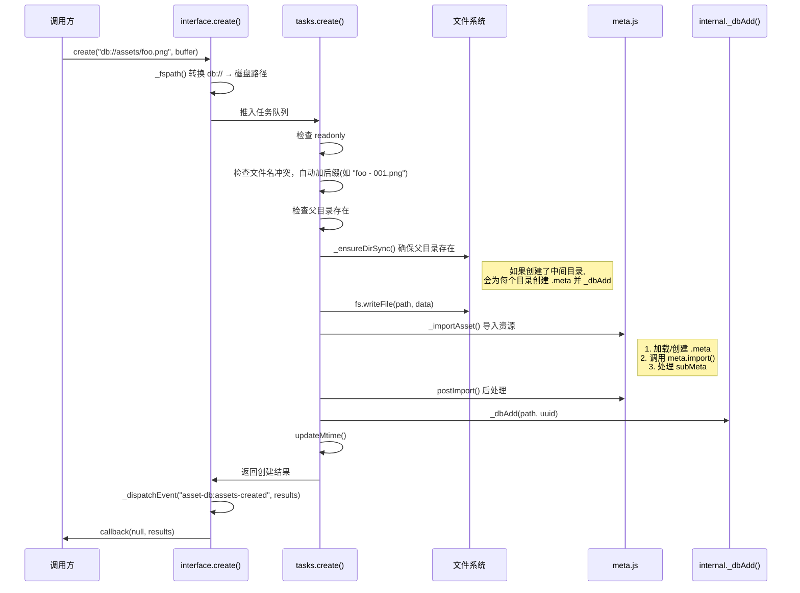
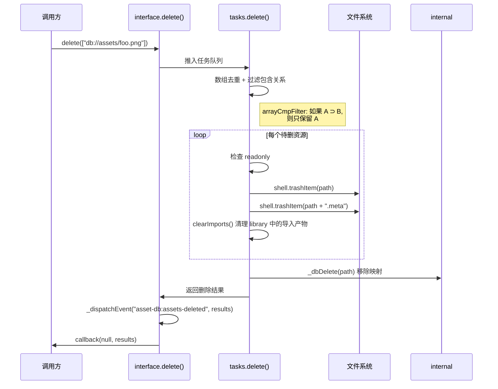
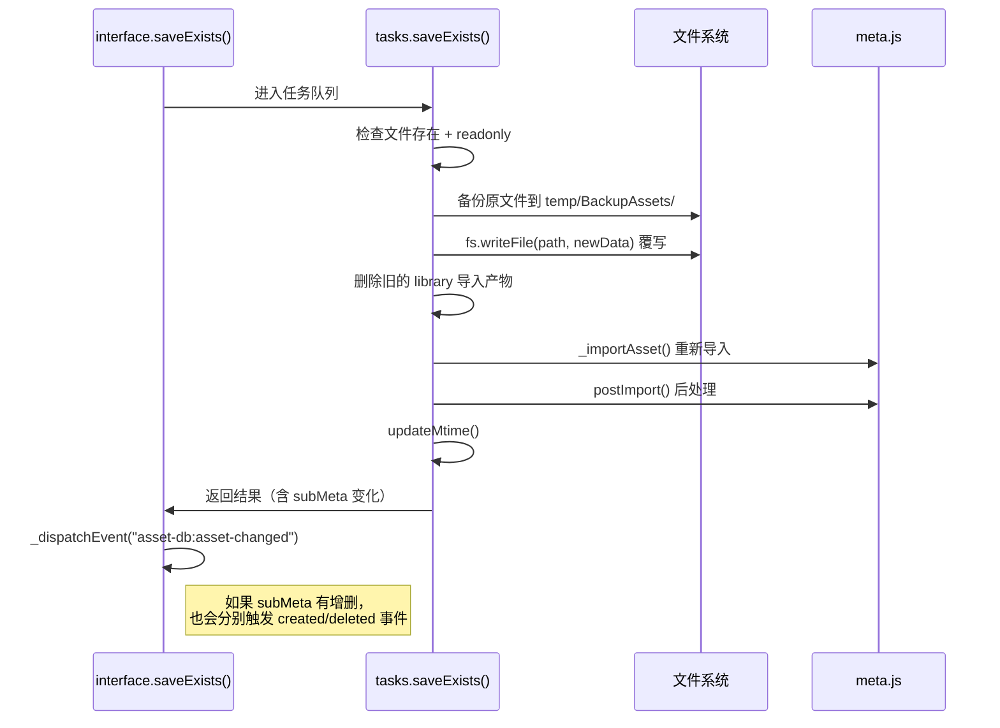
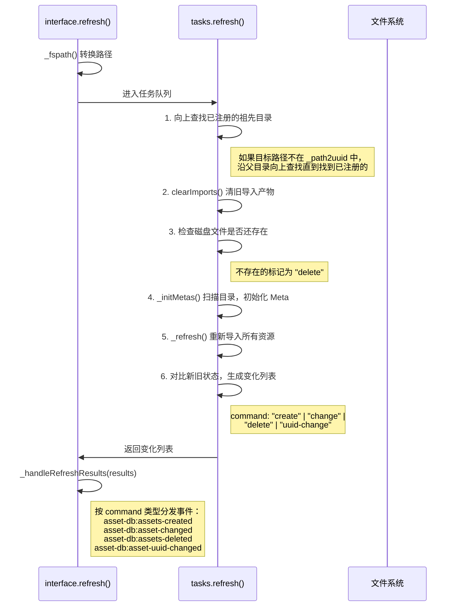
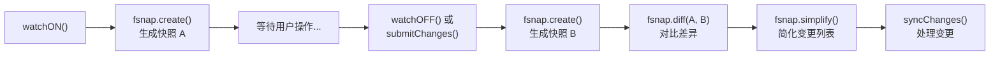
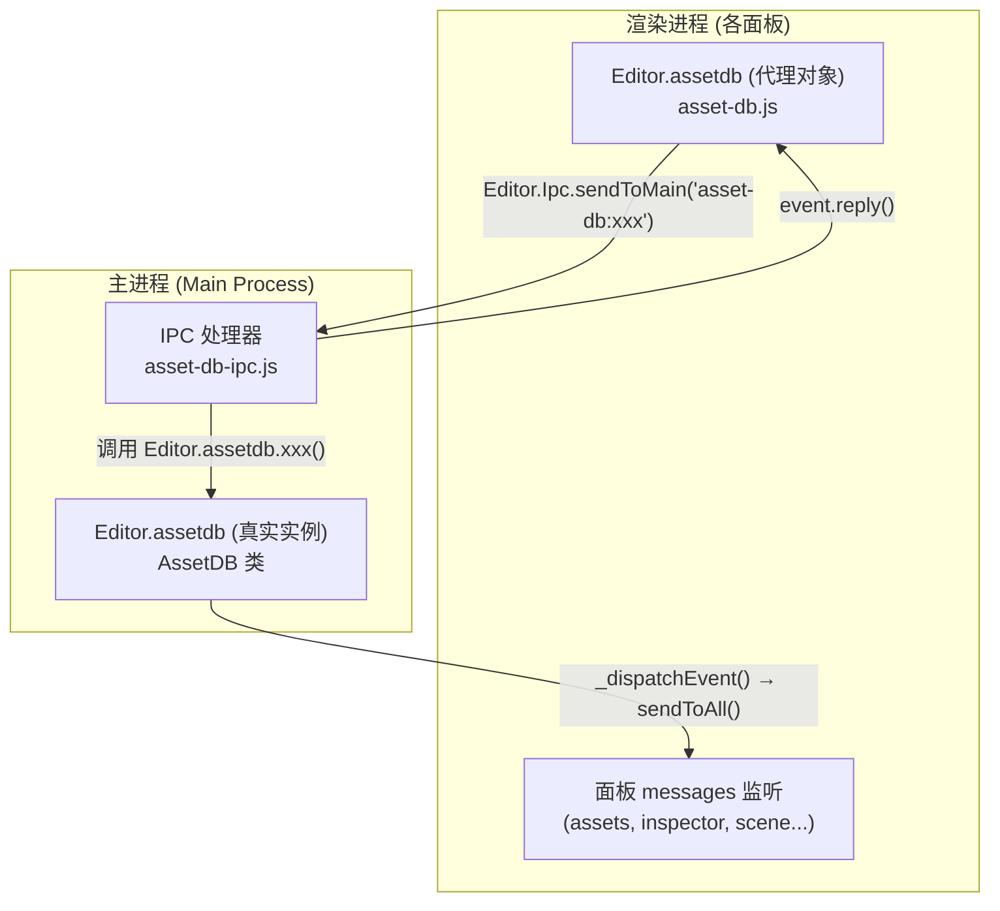

# Cocos Creator 2.4.15 Asset-DB 文件管理机制分析

## 架构概述

Asset-DB 是 Cocos Creator 编辑器中管理项目资源的核心模块，负责资源的增删改查、UUID 映射、Meta 文件管理、文件监视等功能。

### 文件结构

```
asset-db/
├── index.js          # 入口，AssetDB 构造函数，继承 EventEmitter
├── core/
│   ├── fsnap.js      # 文件系统快照（用于 Watch 对比）
│   ├── protocol.js   # Electron 协议注册（uuid://, db://, thumbnail://）
│   └── watch.js      # 文件监视（快照对比模式）
├── lib/
│   ├── interface.js  # 对外 API 接口（CRUD + 查询）
│   ├── tasks.js      # 核心任务实现（24KB，最大最复杂）
│   ├── internal.js   # 内部数据结构操作
│   ├── meta.js       # Meta 文件的创建/加载/保存
│   ├── utils.js      # 工具函数（日志、路径、Library 操作）
│   └── meta/         # Meta 类型定义（RawAsset, Asset, Folder）
```

---

## 核心数据结构

AssetDB 在内存中维护 **5 个核心映射表**（定义于 [index.js](file:///c:/ProgramData/cocos/editors/Creator/2.4.15/resources/app/asset-db/index.js)）：

| 映射表        | 类型                                  | 作用                 |
| ------------- | ------------------------------------- | -------------------- |
| `_path2uuid`  | `{fspath: uuid}`                      | 文件路径 → UUID      |
| `_uuid2path`  | `{uuid: fspath}`                      | UUID → 文件路径      |
| `_uuid2meta`  | `{uuid: Meta}`                        | UUID → Meta 对象缓存 |
| `_uuid2mtime` | `{uuid: {asset, meta, relativePath}}` | UUID → 修改时间信息  |
| `_mounts`     | `{mountPath: MountInfo}`              | 挂载点管理           |

> [!IMPORTANT]
> 所有资源操作最终都要通过 `_dbAdd` / `_dbMove` / `_dbDelete`（[internal.js](file:///c:/ProgramData/cocos/editors/Creator/2.4.15/resources/app/asset-db/lib/internal.js)）来维护这些映射表的一致性。

---

## 增删改查详细流程

### 1. 创建资源 (Create)

**入口**: [interface.js](file:///c:/ProgramData/cocos/editors/Creator/2.4.15/resources/app/asset-db/lib/interface.js) → `create(url, data, callback)`

**核心实现**: [tasks.js → f.create](file:///c:/ProgramData/cocos/editors/Creator/2.4.15/resources/app/asset-db/lib/tasks.js)



**关键细节：**

- **自动去重**: 如果文件已存在，自动在文件名后追加 ` - 001`, ` - 002` 等序号
- **中间目录**: `_ensureDirSync()` 会为每个新创建的中间目录**自动创建 `.meta` 文件**并注册到 DB
- **只读检查**: mount 点标记为 `readonly` 时拒绝创建
- **Import 流程**: 创建文件后会执行 `_importAsset()` → `postImport()` 两阶段导入

---

### 2. 删除资源 (Delete)

**入口**: [interface.js](file:///c:/ProgramData/cocos/editors/Creator/2.4.15/resources/app/asset-db/lib/interface.js) → `delete(urls, callback)`

**核心实现**: [tasks.js → f.delete](file:///c:/ProgramData/cocos/editors/Creator/2.4.15/resources/app/asset-db/lib/tasks.js)



**关键细节：**

- **回收站**: 使用 Electron 的 `shell.trashItem()` 将文件移到操作系统回收站，而非直接删除
- **级联清理**: `clearImports()` 会递归清理 `library/imports/` 下的编译产物
- **路径过滤**: 如果删除 `/a/` 和 `/a/b/`，只会保留 `/a/`（父路径包含子路径）

---

### 3. 修改资源 (Update / Save)

Asset-DB 有两种修改模式：

#### 3.1 修改资源内容: `saveExists(url, data, callback)`

**核心实现**: [tasks.js → f.saveExists](file:///c:/ProgramData/cocos/editors/Creator/2.4.15/resources/app/asset-db/lib/tasks.js)



#### 3.2 修改 Meta 数据: `saveMeta(uuid, jsonString, callback)`

**核心实现**: [tasks.js → f.saveMeta](file:///c:/ProgramData/cocos/editors/Creator/2.4.15/resources/app/asset-db/lib/tasks.js)

流程类似 saveExists，但只修改 `.meta` 文件，不修改资源文件本身。修改后同样会重新导入。

---

### 4. 查询资源 (Query / Read)

Asset-DB 提供了多种**同步查询** API（[interface.js](file:///c:/ProgramData/cocos/editors/Creator/2.4.15/resources/app/asset-db/lib/interface.js)）：

#### 路径/UUID 转换（同步，直接读内存）

| API                  | 说明                   |
| -------------------- | ---------------------- |
| `urlToUuid(url)`     | `db://` URL → UUID     |
| `uuidToUrl(uuid)`    | UUID → `db://` URL     |
| `fspathToUuid(path)` | 磁盘路径 → UUID        |
| `uuidToFspath(uuid)` | UUID → 磁盘路径        |
| `urlToFspath(url)`   | `db://` URL → 磁盘路径 |
| `fspathToUrl(path)`  | 磁盘路径 → `db://` URL |

#### 存在性检查（同步）

| API                  | 说明                    |
| -------------------- | ----------------------- |
| `exists(url)`        | 检查 db:// URL 是否存在 |
| `existsByUuid(uuid)` | 按 UUID 检查            |
| `existsByPath(path)` | 按磁盘路径检查          |

#### 资源信息查询（同步）

| API                     | 返回内容                              |
| ----------------------- | ------------------------------------- |
| `assetInfo(url)`        | `{uuid, path, url, type, isSubAsset}` |
| `assetInfoByUuid(uuid)` | 同上                                  |
| `loadMeta(url)`         | 读取并返回完整 Meta 对象              |

#### 批量查询（异步，通过任务队列）

| API                               | 说明                               |
| --------------------------------- | ---------------------------------- |
| `deepQuery(cb)`                   | 查询所有已注册资源（含树结构信息） |
| `queryAssets(pattern, types, cb)` | 按路径模式 + 类型筛选              |
| `queryMetas(pattern, type, cb)`   | 按路径模式查询 Meta                |

---

### 5. 刷新资源 (Refresh)

**入口**: [interface.js](file:///c:/ProgramData/cocos/editors/Creator/2.4.15/resources/app/asset-db/lib/interface.js) → `refresh(url, callback)`

**核心实现**: [tasks.js → f.refresh](file:///c:/ProgramData/cocos/editors/Creator/2.4.15/resources/app/asset-db/lib/tasks.js)

这是 **MCP Bridge 最常使用的 API 之一**。



> [!WARNING]
> **路径查找逻辑**: 当刷新的路径不在 `_path2uuid` 中时，会**自动向上查找**最近的已注册祖先目录。这意味着刷新一个新创建的子目录时，实际可能刷新了一个更高层级的目录。

---

### 6. 移动/重命名资源 (Move)

**入口**: [interface.js](file:///c:/ProgramData/cocos/editors/Creator/2.4.15/resources/app/asset-db/lib/interface.js) → `move(srcUrl, destUrl, callback)`

**核心实现**: [tasks.js → f.move / f.assetMove](file:///c:/ProgramData/cocos/editors/Creator/2.4.15/resources/app/asset-db/lib/tasks.js)

流程：

1. 检查 src 和 dest 的 readonly 状态
2. `_checkMoveInput()` 验证输入合法性
3. `assetMove()` 执行：扫描源路径所有子资源 → `fs.rename` 移动文件及 `.meta` → 更新内部映射 `_dbMove()` → 如果扩展名变化则重新导入

---

## 文件监视机制 (Watch)

**核心文件**: [watch.js](file:///c:/ProgramData/cocos/editors/Creator/2.4.15/resources/app/asset-db/core/watch.js) + [fsnap.js](file:///c:/ProgramData/cocos/editors/Creator/2.4.15/resources/app/asset-db/core/fsnap.js)

Asset-DB 使用**快照对比**模式（而非 `fs.watch`）来检测文件变化：



`fsnap.create()` 的工作原理：

- 使用 `fast-glob` 遍历所有挂载目录的 `**/*`
- 获取每个路径的 `fs.statSync()` 信息
- 存入 `Map<path, stat>` 作为快照

`fsnap.diff()` 对比：

- **deletes**: 旧快照有、新快照没有的路径
- **creates**: 新快照有、旧快照没有的路径
- **changes**: 都有但 `mtime` 不同的文件

---

## Meta 文件管理

**核心文件**: [meta.js](file:///c:/ProgramData/cocos/editors/Creator/2.4.15/resources/app/asset-db/lib/meta.js)

每个资源文件都有对应的 `.meta` 文件，记录 UUID、导入配置、子资源信息等。

| 操作                                         | 说明                                       |
| -------------------------------------------- | ------------------------------------------ |
| `meta.create(db, metapath, uuid, json)`      | 根据文件扩展名查找对应 Meta 类型，创建实例 |
| `meta.load(db, metapath, json?)`             | 从 `.meta` 文件加载 Meta 对象              |
| `meta.save(db, metapath, meta)`              | 序列化 Meta 并写入 `.meta` 文件            |
| `meta.findCtor(db, assetpath, json)`         | 根据扩展名查找注册的 Meta 类构造函数       |
| `meta.register(db, extname, isFolder, ctor)` | 注册扩展名 → Meta 类型的映射               |

Meta 类型匹配优先级：

1. `_extname2infos[ext]` 中注册的类型（后注册的优先）
2. 目录 → `FolderMeta`
3. 未知文件 → `defaultMetaType`（通常是 `RawAssetMeta`）

---

## 事件系统

所有资源变更都通过 `_dispatchEvent()` 广播到编辑器各窗口：

| 事件名                          | 触发时机     | 数据                                         |
| ------------------------------- | ------------ | -------------------------------------------- |
| `asset-db:assets-created`       | 资源创建     | `[{uuid, parentUuid, url, path, type, ...}]` |
| `asset-db:assets-deleted`       | 资源删除     | `[{uuid, url, path, type}]`                  |
| `asset-db:asset-changed`        | 资源修改     | `{uuid, type}`                               |
| `asset-db:asset-uuid-changed`   | UUID 变更    | `{uuid, oldUuid, type}`                      |
| `asset-db:assets-moved`         | 资源移动     | `[{uuid, srcPath, destPath, ...}]`           |
| `asset-db:state-changed`        | DB 状态变化  | `"busy"` / `"idle"`                          |
| `asset-db:watch-state-changed`  | 监视状态变化 | 状态字符串                                   |
| `asset-db:script-import-failed` | 脚本导入失败 | 错误信息                                     |
| `asset-db:meta-backup`          | Meta 备份    | 备份路径列表                                 |

事件分发路由（[browser.js](file:///c:/ProgramData/cocos/editors/Creator/2.4.15/resources/app/editor/lib/asset-db/browser.js)）：

- `watch-state-changed` / `state-changed` → 仅发送到主窗口 (`sendToMainWin`)
- 其他事件 → 广播到所有窗口 (`sendToAll`)

---

## 挂载系统 (Mount)

AssetDB 支持多个挂载点，每个挂载点映射一个磁盘目录到一个 `db://` 命名空间：

| 挂载点     | 磁盘路径                          | 说明                         |
| ---------- | --------------------------------- | ---------------------------- |
| `assets`   | `{project}/assets/`               | 项目主资源目录               |
| `internal` | `{editor}/static/default-assets/` | 内置资源（hidden, readonly） |
| 外部挂载   | 自定义路径                        | 通过命令行参数指定           |

初始化顺序（[browser.js](file:///c:/ProgramData/cocos/editors/Creator/2.4.15/resources/app/editor/lib/asset-db/browser.js)）：

1. `mountInternal()` → 挂载内置资源
2. `mountExternal()` → 挂载外部目录（如果有）
3. `mountMain()` → 挂载项目 assets 目录
4. `init()` → 初始化所有挂载点（扫描、导入、清理）

---

## 任务队列机制

所有**写操作**都通过 `async.queue(concurrency=1)` 的串行任务队列执行，确保不会有并发冲突：

```javascript
// index.js 中初始化
this._tasks = async.queue((task, callback) => {
	// 设置状态为 busy
	// 打印任务日志
	// 执行 task.run()
	// 完成后设置状态为 idle
}, 1); // 并发数 = 1
```

> [!TIP]
> 这就是为什么在 MCP Bridge 中连续调用多个 assetdb API 时，它们会串行执行，不需要手动加锁。但也意味着**如果队列前方有长时间任务，后续调用会被阻塞**。

---

## 与 MCP Bridge 的关系

| MCP Bridge 常用 API | 对应 AssetDB 方法                 | 注意事项                   |
| ------------------- | --------------------------------- | -------------------------- |
| 创建资源            | `Editor.assetdb.create()`         | 父目录必须存在，否则报错   |
| 刷新目录            | `Editor.assetdb.refresh()`        | 路径不存在时会向上查找祖先 |
| 查询 UUID           | `Editor.assetdb.urlToUuid()`      | 同步操作，直接读内存       |
| 查询资源信息        | `Editor.assetdb.queryInfoByUrl()` | 异步，通过 IPC             |

> [!CAUTION]
> **`create()` 不会自动创建父目录的 DB 注册**。虽然 `_ensureDirSync()` 会在磁盘上创建目录并注册到 DB，但如果你先用 `fs` 模块手动创建了目录再调用 `create()`，Asset-DB 可能不知道这些目录的存在。**正确做法是让 AssetDB 自己处理目录创建，或在创建后刷新父目录**。

---

## IPC 消息交互机制

外部模块（插件、面板、渲染进程）与 Asset-DB 的交互分为**三层**：



### 第 1 层：主进程 IPC 处理器

**核心文件**: [asset-db-ipc.js](file:///c:/ProgramData/cocos/editors/Creator/2.4.15/resources/app/editor/core/ipc/asset-db-ipc.js)

这是 **所有 IPC 消息的入口**，通过 `ipcMain.on()` 注册处理器，将 IPC 请求转发给 `Editor.assetdb` 实例。

#### 查询类 IPC（同步响应，`event.reply()`）

| IPC 消息名 | 调用的 AssetDB API | 说明 |
|-----------|-------------------|------|
| `asset-db:exists` | `Editor.assetdb.exists(url)` | 检查资源是否存在 |
| `asset-db:query-path-by-url` | `Editor.assetdb._fspath(url)` | db:// URL → 磁盘路径 |
| `asset-db:query-uuid-by-url` | `Editor.assetdb.urlToUuid(url)` | db:// URL → UUID |
| `asset-db:query-path-by-uuid` | `Editor.assetdb.uuidToFspath(uuid)` | UUID → 磁盘路径 |
| `asset-db:query-url-by-uuid` | `Editor.assetdb.uuidToUrl(uuid)` | UUID → db:// URL |
| `asset-db:query-info-by-uuid` | `Editor.assetdb.assetInfoByUuid(uuid)` | 查询资源完整信息 |
| `asset-db:query-meta-info-by-uuid` | 手动组装 Meta 信息 | 返回 `{assetType, defaultType, assetUrl, assetPath, metaPath, json, ...}` |
| `asset-db:deep-query` | `Editor.assetdb.deepQuery(cb)` | 查询所有资源树 |
| `asset-db:query-assets` | `Editor.assetdb.queryAssets(pattern, types, cb)` | 按模式查询 |
| `asset-db:query-mounts` | 直接返回 `_mounts` | 查询挂载点 |
| `asset-db:query-watch-state` | `Editor.assetdb.getWatchState()` | 查询文件监视状态 |
| `asset-db:explore` | `shell.showItemInFolder(fspath)` | 在文件管理器中显示 |

#### 写操作类 IPC（异步回调）

> [!IMPORTANT]
> **所有写操作 IPC 都有一个关键模式：先关闭 Watch，执行操作，再开启 Watch**。这避免了外部文件变更与 AssetDB 内部操作产生冲突。

```javascript
// 每个写操作 IPC 的标准模式（以 create-asset 为例）
ipcMain.on("asset-db:create-asset", (event, url, data) => {
    Editor.AssetDB.runDBWatch("off");         // 1. 关闭文件监视
    Editor.assetdb.create(url, data, (err, results) => {
        event.reply(err, results);            // 2. 异步回调返回结果
    });
    Editor.App.focused || Editor.AssetDB.runDBWatch("on"); // 3. 重开监视
});
```

| IPC 消息名 | 调用的 AssetDB API | 说明 |
|-----------|-------------------|------|
| `asset-db:create-asset` | `Editor.assetdb.create(url, data, cb)` | 创建资源 |
| `asset-db:delete-assets` | `Editor.assetdb.delete(urls, cb)` | 删除资源（移到回收站） |
| `asset-db:move-asset` | `Editor.assetdb.move(src, dest, cb)` | 移动/重命名资源 |
| `asset-db:save-exists` | `Editor.assetdb.saveExists(url, data, cb)` | 覆写已存在资源 |
| `asset-db:create-or-save` | `exists()` → `saveExists()` 或 `create()` | 智能创建或覆写 |
| `asset-db:save-meta` | `Editor.assetdb.saveMeta(uuid, json, cb)` | 保存 Meta |
| `asset-db:import-assets` | `Editor.assetdb.import(files, dest, cb)` | 导入外部文件 |
| `asset-db:refresh` | `Editor.assetdb.refresh(url, cb)` | 刷新指定路径 |
| `asset-db:attach-mountpath` | `Editor.assetdb.attachMountPath(name, cb)` | 挂载路径 |
| `asset-db:unattach-mountpath` | `Editor.assetdb.unattachMountPath(name, cb)` | 卸载路径 |

#### 事件转发类 IPC（主进程内部响应广播事件）

这些处理器响应 AssetDB 广播出来的事件，执行**主进程侧**的副作用：

| IPC 消息名 | 处理逻辑 |
|-----------|----------|
| `asset-db:asset-changed` | 如果是脚本类型，触发 `ProjectCompiler.compileScripts()` |
| `asset-db:asset-uuid-changed` | 如果需要编译，触发 `ProjectCompiler.rebuild()` |
| `asset-db:assets-created` | 编译新脚本，更新 `sceneList` |
| `asset-db:assets-deleted` | 移除已删脚本，更新 `sceneList` |
| `asset-db:assets-moved` | 调用 `ProjectCompiler.moveScripts()` 更新编译路径 |
| `asset-db:script-import-failed` | 通知编译器单脚本编译失败 |
| `asset-db:meta-backup` | 显示 Meta 备份对话框（可配置） |

---

### 第 2 层：渲染进程代理 API

**核心文件**: [asset-db.js](file:///c:/ProgramData/cocos/editors/Creator/2.4.15/resources/app/editor/page/asset-db.js)

渲染进程中的各面板通过 `Editor.assetdb` 代理对象间接调用主进程 API。**每个方法都通过 `Editor.Ipc.sendToMain()` 发送 IPC 消息到主进程**：

```javascript
// 渲染进程中调用示例
Editor.assetdb.create("db://assets/textures/icon.png", buffer, (err, results) => {
    // results 来自主进程的 event.reply()
});

// 实际等价于：
Editor.Ipc.sendToMain("asset-db:create-asset", url, data, callback, -1);
//                                                                  ^^^ -1 = 无超时
```

渲染进程代理 API 完整列表：

| 代理方法 | 对应 IPC 消息 |
|---------|--------------|
| `Editor.assetdb.exists(url, cb)` | `asset-db:exists` |
| `Editor.assetdb.queryPathByUrl(url, cb)` | `asset-db:query-path-by-url` |
| `Editor.assetdb.queryUuidByUrl(url, cb)` | `asset-db:query-uuid-by-url` |
| `Editor.assetdb.queryPathByUuid(uuid, cb)` | `asset-db:query-path-by-uuid` |
| `Editor.assetdb.queryUrlByUuid(uuid, cb)` | `asset-db:query-url-by-uuid` |
| `Editor.assetdb.queryInfoByUuid(uuid, cb)` | `asset-db:query-info-by-uuid` |
| `Editor.assetdb.queryMetaInfoByUuid(uuid, cb)` | `asset-db:query-meta-info-by-uuid` |
| `Editor.assetdb.deepQuery(cb)` | `asset-db:deep-query` |
| `Editor.assetdb.queryAssets(pattern, types, cb)` | `asset-db:query-assets` |
| `Editor.assetdb.create(url, data, cb)` | `asset-db:create-asset` |
| `Editor.assetdb.move(src, dest, showDialog, cb)` | `asset-db:move-asset` |
| `Editor.assetdb.delete(urls, cb)` | `asset-db:delete-assets` |
| `Editor.assetdb.saveExists(url, data, cb)` | `asset-db:save-exists` |
| `Editor.assetdb.createOrSave(url, data, cb)` | `asset-db:create-or-save` |
| `Editor.assetdb.saveMeta(uuid, json, cb)` | `asset-db:save-meta` |
| `Editor.assetdb.refresh(url, cb)` | `asset-db:refresh` |
| `Editor.assetdb.import(files, dest, showFile, cb)` | `asset-db:import-assets` |
| `Editor.assetdb.explore(url)` | `asset-db:explore` |
| `Editor.assetdb.exploreLib(url)` | `asset-db:explore-lib` |

> [!NOTE]
> 渲染进程中还可以通过 `Editor.assetdb.remote` 直接访问主进程的 `Editor.assetdb` 实例（Electron remote），但这种方式已经不推荐使用。

---

### 第 3 层：面板事件监听

各编辑器面板通过 `messages` 对象监听 AssetDB 广播的事件，实现 UI 同步更新：

#### Assets 面板 ([assets/panel/index.js](file:///c:/ProgramData/cocos/editors/Creator/2.4.15/resources/app/editor/builtin/assets/panel/index.js))

| 事件 | 处理 |
|------|------|
| `asset-db:assets-created` | 向树形结构添加新节点，自动展开父目录并滚动到位 |
| `asset-db:assets-moved` | 更新节点的名称和父级 |
| `asset-db:assets-deleted` | 从树中移除节点，取消选中 |
| `asset-db:asset-changed` | 高亮提示节点，更新纹理图标 |
| `asset-db:asset-uuid-changed` | 更新节点的 UUID |

#### Inspector 面板 ([inspector/panel/index.js](file:///c:/ProgramData/cocos/editors/Creator/2.4.15/resources/app/editor/builtin/inspector/panel/index.js))

| 事件 | 处理 |
|------|------|
| `asset-db:assets-moved` | 如果当前选中的资源被移动，强制刷新 Inspector |
| `asset-db:asset-changed` | 如果当前选中的资源变化，强制刷新 Inspector |
| `asset-db:asset-uuid-changed` | 更新当前检查的资源 UUID |

#### Scene 面板 ([scene/panel/messages/asset-db.js](file:///c:/ProgramData/cocos/editors/Creator/2.4.15/resources/app/editor/builtin/scene/panel/messages/asset-db.js))

| 事件 | 处理 |
|------|------|
| `asset-db:asset-changed` | `_Scene.assetChanged()` 更新场景中引用的资源 |
| `asset-db:assets-moved` | `_Scene.assetsMoved()` 处理资源移动 |
| `asset-db:assets-created` | `_Scene.assetsCreated()` 处理新资源 |
| `asset-db:assets-deleted` | `_Scene.assetsDeleted()` 清理已删资源的引用 |

#### Builder 面板、Project Settings 面板

监听 `assets-created/deleted/moved` 事件来更新场景列表。

---

### MCP Bridge 中的 IPC 使用模式

在 MCP Bridge 插件的 [main.js](file:///c:/ProgramData/cocos/editors/Creator/2.4.15/resources/app/editor/builtin/node-library/main.js) 中，因为运行在**主进程**，可以直接调用 `Editor.assetdb` 实例方法，无需通过 IPC：

```javascript
// ✅ MCP Bridge (主进程) - 直接调用
Editor.assetdb.create("db://assets/foo.png", buffer, callback);
Editor.assetdb.refresh("db://assets/textures/", callback);
let uuid = Editor.assetdb.urlToUuid("db://assets/bar.prefab");  // 同步

// ❌ 不需要这样做（这是给渲染进程用的）
Editor.Ipc.sendToMain("asset-db:create-asset", ...);
```

但对于 `scene-script.js`（渲染进程），需要通过 IPC：

```javascript
// scene-script.js (渲染进程) - 需要通过 IPC 或 Editor.assetdb 代理
Editor.assetdb.queryUrlByUuid(uuid, (err, url) => {
    // 这内部会发 IPC 到主进程
});
```

> [!TIP]
> **关键区别**: 主进程中 `Editor.assetdb` 是 AssetDB 类的**真实实例**，可以同步调用 `urlToUuid()` 等方法；渲染进程中 `Editor.assetdb` 是一个**代理对象**，所有调用都通过 IPC 异步转发到主进程。
